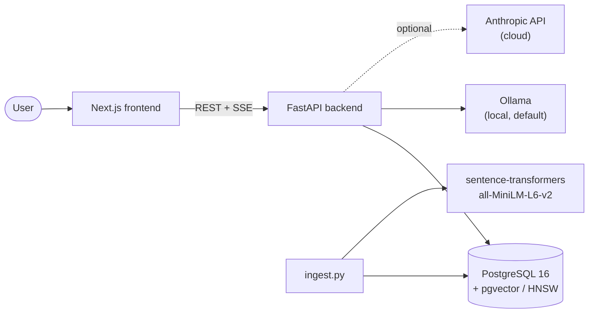
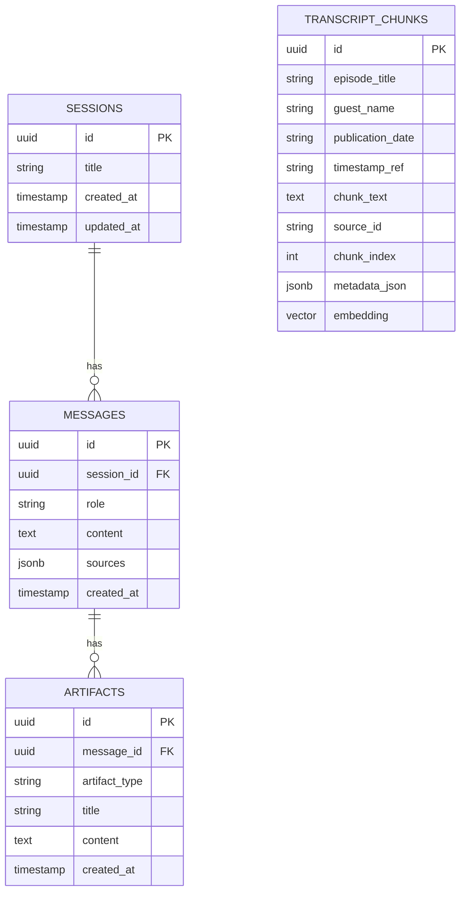
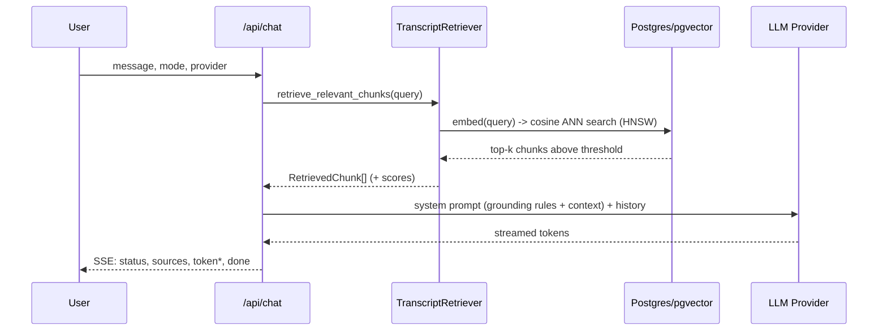

# Architecture — The Lenny Growth Assistant

## System overview

## Component boundaries

- **frontend/** — Next.js App Router, client-rendered chat + artifact UI.
  Talks to the backend only over the documented REST/SSE contract; no
  direct DB access, no LLM calls from the browser (section 35).
- **backend/app/api/** — thin HTTP layer: validation, session/response
  persistence, SSE framing. No business logic beyond orchestration.
- **backend/app/agent/** — routing (`router.py`) and orchestration
  (`orchestrator.py`): decides which skill/pipeline handles a request and
  turns its output into the SSE event sequence.
- **backend/app/rag/** — retrieval (`retriever.py`), embeddings
  (`embeddings.py`), prompt construction (`prompts.py`,
  `ship30_prompts.py`, `artifact_prompts.py`), citation formatting
  (`citation.py`), and ingestion chunking (`chunker.py`). The only layer
  that knows pgvector/HNSW exists.
- **backend/app/skills/** — Ship30 essay writer and artifact generator.
  Each is a pure function of (topic, retrieved chunks, provider) → text —
  no API or DB concerns.
- **backend/app/providers/** — `BaseLLMProvider` + Ollama/Anthropic
  implementations + factory. The only layer that knows which cloud SDK or
  HTTP API is in use.
- **backend/app/models/** — `db_models.py` (SQLAlchemy/storage) and
  `schemas.py` (Pydantic/wire contract) are kept deliberately separate.

## Database schema

See `backend/app/models/db_models.py` for the authoritative definitions.
Summary:

`transcript_chunks` has a unique index on `(source_id, chunk_index)` (idempotent
re-ingestion) and an HNSW index on `embedding` using `vector_cosine_ops` —
verified live in this build against a real Postgres+pgvector instance (see
`agent_transcripts/02_database_setup.md`).

## API contracts

See `backend/app/models/schemas.py` for exact request/response shapes.
Endpoints (all under `/api`, all implemented and tested):

| Method | Path | Purpose |
|---|---|---|
| POST | `/sessions` | Create a session |
| GET | `/sessions` | List sessions |
| GET | `/sessions/{id}` | Session + full message/artifact history |
| POST | `/chat` | Grounded chat, SSE response (`default` \| `ship30` \| `artifact` mode) |
| GET | `/artifacts/{id}` | Read one persisted artifact |
| GET | `/health` | Structured dependency diagnostics |

SSE event sequence for `/chat` (section 20): `status` → `sources` →
(`status` →) `token`* → (`artifact`) → `done`, or `error` at any point if
something fails after the stream has already started (see
`backend/app/api/chat.py`'s docstring for why errors can't just become an
HTTP status code once streaming has begun).

## RAG pipeline

If retrieval returns nothing above `RETRIEVAL_THRESHOLD`, the system
prompt's context block says so explicitly (`format_context_block` in
`citation.py`), and the grounding rules instruct the model to use the
fixed refusal string rather than answer from general knowledge — this is
enforced by prompt instruction, not a code-level short-circuit, so it's
provider-agnostic and was verified via `test_api.py`'s mocked-provider
tests (empty context ⇒ empty `sources` array; the actual refusal text
depends on the LLM honoring the system prompt, same as any other
grounding rule here).

## Embedding pipeline

`sentence-transformers/all-MiniLM-L6-v2` (384-dim), loaded once per
process (`app/rag/embeddings.py`), used identically for ingestion
(`embed_batch`) and query time (`embed_text`) so index and query vectors
live in the same space. **Sandbox note:** this dependency (and its model
weights) couldn't be installed/downloaded in the build sandbox — see
`docs/troubleshooting.md` — so this module's correctness was verified with
a monkeypatched embedding function against a real pgvector index instead
of a live model load.

## Provider abstraction

`BaseLLMProvider` (`app/providers/base.py`) defines
`generate_response` / `stream_response` / `health_check`.
`ProviderFactory.get_provider(name)` is the only place that constructs a
concrete provider; nothing else imports `OllamaProvider` or
`AnthropicProvider` directly. Both `generate_response` (non-streaming, used
by the Ship30/artifact skills) and `stream_response` (used by default
chat) receive the *same* grounding system prompt, so the "don't answer
outside context" guarantee doesn't depend on which is used.

## Agent routing

`resolve_mode()` (`app/agent/router.py`) is driven by the request's
explicit `mode` field — a structured enum, not string-matching on the
message text. `infer_mode_from_text()` is a documented, currently-inert
seam for adding free-text intent classification (e.g. "turn that into an
essay" typed into the default box) without touching the routing contract.

## Ship30 skill

`app/skills/ship30_writer.py` — takes retrieved chunks + a topic, builds a
dedicated system prompt (structural rules: hook, headings, word count,
grounding — `app/rag/ship30_prompts.py`), and calls the resolved
provider's `generate_response`. Raises `InsufficientContextError` (HTTP
422) rather than generating an ungrounded essay when retrieval is empty.

## Artifact generation

`app/skills/artifact_generator.py` — same shape as Ship30, for
Markdown/HTML. HTML output is validated to actually start with
`<!DOCTYPE html>`/`<html`before being accepted; Markdown output has a
defensive code-fence-stripping pass in case the model wraps its response
despite instructions not to.

## Artifact security

See section 18's threat model, restated concretely for this codebase in
`frontend/src/components/Artifact/SandboxedIframe.tsx`'s docstring:
`sandbox="allow-scripts"` with **no** `allow-same-origin`, so a generated
HTML artifact gets its own opaque origin — it cannot read this app's DOM,
cookies, or localStorage, and can't use `document.domain` to rejoin the
parent's origin either, because there is no shared origin to rejoin.
Markdown artifacts go through `react-markdown` (which does not render raw
HTML unless the `rehype-raw` plugin is added — deliberately not added
here) plus a DOMPurify pass as defense-in-depth.

## Docker deployment

`docker-compose.yml`: `db` (pgvector image) → `backend` (waits on `db`
via `condition: service_healthy`) → `frontend`. `backend`'s own startup
(`init_db()`) additionally retries against a not-yet-ready Postgres, so
container-orchestration health checks and the app's own resilience are
two independent layers, not one relying on the other. `ollama` is included
as an optional service — many developers run Ollama natively for GPU
access instead; see `docs/troubleshooting.md`.

## Failure handling

Every external dependency (DB, Ollama, Anthropic, embeddings) has its own
`AppError` subclass with a fixed `code` and HTTP status
(`backend/app/exceptions.py`), and the API never leaks a raw traceback —
unhandled exceptions are logged with full detail server-side and returned
to the client as a generic `INTERNAL_ERROR`. Mid-SSE-stream failures
(after the HTTP status is already committed) are relayed as an `error`
event instead, so the stream always terminates cleanly rather than hanging
or dying silently.
